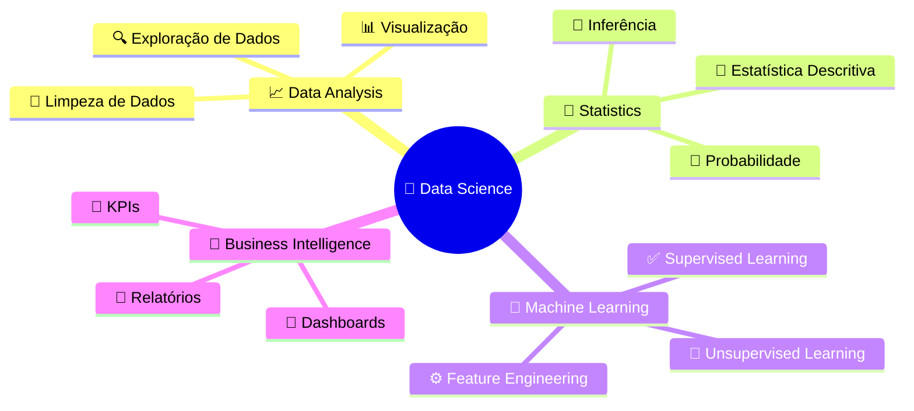

<div align="center">
  
# 👋 Olá, eu sou Aline Herculano!


[](https://www.linkedin.com/in/aline-herculano-67b425289/)
[](https://github.com/herculanaline)
[]()

</div>

---

## 🎯 Sobre Mim

```python
class AlineHerculano:
    def __init__(self):
        self.location = "Fortaleza, CE - Brazil"
        self.current_focus = "Data Science & Analytics"
        self.learning = ["Python", "SQL", "Machine Learning", "Data Visualization"]
        self.interests = ["Data Analysis", "Statistics", "Business Intelligence"]
    
    def say_hi(self):
        print("Apaixonada por transformar dados em decisões estratégicas! 📊")

me = AlineHerculano()
me.say_hi()
```

---

## 🛠️ Tecnologias & Ferramentas

<div align="center">

### 💻 Linguagens


### 📊 Data Science & Analytics


### 🎨 Design & Dev Tools


</div>

---

## 📈 Estatísticas GitHub

<p>
  
  
</p>

---

## 🚀 Projetos em Destaque

<div align="center">

[](https://github.com/herculanaline/alurabook)
[](https://github.com/herculanaline/freeway)

</div>

---

## 📊 Áreas de Interesse

\```

## 🌱 Atualmente Estudando

- 📊 **Análise de Dados** com Python
- 🗄️ **SQL** e bancos de dados relacionais
- 📉 **Estatística** aplicada à Ciência de Dados

---

## 💡 Quote

<div align="center">


</div>

---

<div align="center">

### 📫 Vamos Conectar?

**Sempre aberta para colaborar em projetos de dados e trocar conhecimentos!**


</div>

---

<div align="center">
  
### ⚡ Fun Fact
  
*"Dados são o novo petróleo, mas apenas se você souber refiná-los!"* 🛢️➡️💎

</div>
